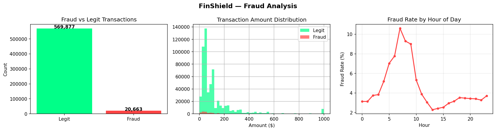
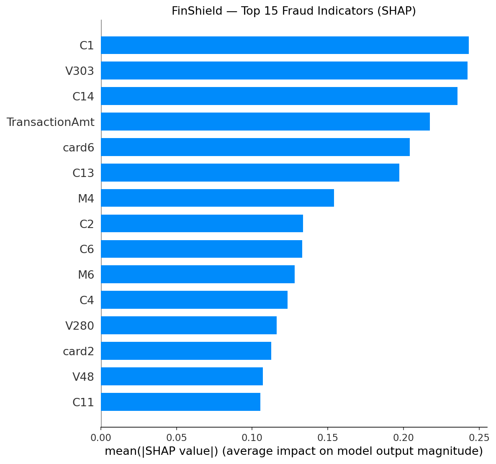

# 🛡️ FinShield — Real-Time Fraud Detection System

> End-to-end ML pipeline for credit-card fraud detection: from raw data to real-time scoring API with SHAP explanations, Kafka streaming, and automated retraining.

[](https://github.com/kingslayer2005/FinShield/actions)


---

## Architecture

```
┌────────────────────────────────────────────────────────────────────────┐
│                        FinShield Architecture                         │
├────────────────────────────────────────────────────────────────────────┤
│                                                                        │
│  ┌──────────┐    ┌──────────────┐    ┌──────────────────────────────┐  │
│  │ Kaggle   │───>│ Preprocessing│───>│ Feature Engineering          │  │
│  │ IEEE-CIS │    │ + EDA        │    │ (behavioral + time + amount) │  │
│  └──────────┘    └──────────────┘    └──────────────┬───────────────┘  │
│                                                      │                 │
│                                          ┌───────────▼────────────┐   │
│                                          │   Model Training       │   │
│                                          │  ┌─────────────────┐   │   │
│                                          │  │ XGBoost         │   │   │
│                                          │  │ Autoencoder     │   │   │
│                                          │  │ LSTM            │   │   │
│                                          │  │ Stacking LR     │   │   │
│                                          │  └─────────────────┘   │   │
│                                          └───────────┬────────────┘   │
│                                                      │                 │
│   ┌──────────────────────────────────────────────────▼──────────────┐  │
│   │                    Serving Layer                                │  │
│   │                                                                 │  │
│   │  ┌─────────────┐   ┌───────────────┐   ┌───────────────────┐   │  │
│   │  │ FastAPI      │   │ Kafka         │   │ Streamlit Demo    │   │  │
│   │  │ /predict     │   │ Producer →    │   │ Interactive       │   │  │
│   │  │ /health      │   │ Consumer      │   │ SHAP Waterfall    │   │  │
│   │  │ /model-info  │   │ (Redis+PG)    │   │                   │   │  │
│   │  └─────────────┘   └───────────────┘   └───────────────────┘   │  │
│   └─────────────────────────────────────────────────────────────────┘  │
│                                                                        │
│   ┌─────────────────────────────────────────────────────────────────┐  │
│   │                    MLOps Layer                                  │  │
│   │  MLflow Tracking │ Evidently Drift │ Prometheus + Grafana      │  │
│   │  Airflow Retrain │ Champion/Challenger Promotion               │  │
│   └─────────────────────────────────────────────────────────────────┘  │
└────────────────────────────────────────────────────────────────────────┘
```

---

## Results

> **Results pending full-data run.**
> Run `.\run_all.ps1` or `make train` with real Kaggle data to generate metrics.

### Smoke-Test Baseline (Synthetic Data)

| Model | PR-AUC | ROC-AUC | In Ensemble |
|-------|--------|---------|-------------|
| XGBoost | 0.9259 | 0.93 | ✓ |
| Autoencoder | — | — | ✓ |
| LSTM | — | — | ✓ |
| **Ensemble** | **0.9355** | — | — |

> Fraud recall: **0.87** on test set. Full-data results will replace this table automatically via `scripts/generate_readme_table.py`.

---

## Dataset

**IEEE-CIS Fraud Detection** (Kaggle) — 590K transactions with 3.5% fraud rate.

- **Features**: 394 raw columns (card, address, email domain, device, Vesta engineered C/D/M/V features)
- **Target**: `isFraud` (binary)
- **Split**: 70/15/15 chronological by `TransactionDT` (no data leakage)

<details>
<summary>EDA Highlights</summary>



Key findings:
- **Class imbalance**: 96.5% legit vs 3.5% fraud → handled via `scale_pos_weight` + SMOTE experiments
- **Fraud peaks at 5-8 AM** (off-hours pattern)
- **Amount distribution**: fraud skews toward small amounts ($0–$200)
</details>

---

## Project Structure

```
FinShield/
├── config.yaml                 # All tuneable settings (no magic numbers in code)
├── run_all.ps1                 # One-command full pipeline (Windows)
├── Makefile                    # One-command full pipeline (Linux/Mac)
├── docker-compose.yml          # Kafka, Redis, Postgres, MLflow, Prometheus, Grafana, Airflow
├── requirements.txt            # Pinned dependencies for Python 3.11
│
├── data/
│   ├── scripts/preprocess.py   # Cleaning, splitting, encoding, feature engineering
│   └── synthetic/              # Auto-generated smoke data for CI
│
├── features/
│   └── behavioral.py           # Per-card rolling window features (offline)
│
├── models/
│   ├── train_xgboost.py        # XGBoost with scale_pos_weight + early stopping
│   ├── train_autoencoder.py    # Reconstruction-error anomaly detector
│   ├── train_lstm.py           # Sequence model on per-card transaction history
│   ├── ensemble.py             # Stacking LR + model gate (auto-include/exclude)
│   ├── evaluate.py             # Test-set evaluation → reports/metrics.json
│   └── saved/                  # Serialised model artifacts (.pkl, .keras)
│
├── explainability/
│   └── shap_explainer.py       # Global + per-transaction SHAP explanations
│
├── api/
│   └── app.py                  # FastAPI scoring API with SHAP reasons
│
├── streaming/
│   ├── producer.py             # Kafka replay of test transactions at configurable rate
│   └── consumer.py             # Real-time scoring with Redis behavioral features → Postgres
│
├── monitoring/
│   ├── drift.py                # Evidently drift detection (reference vs current)
│   ├── prometheus.yml          # Prometheus scrape config
│   └── grafana/                # Dashboard JSON + provisioning
│
├── airflow/
│   └── dags/retrain_dag.py     # Weekly retrain DAG with champion/challenger promotion
│
├── demo/
│   └── app.py                  # Streamlit interactive demo (HF Spaces deployable)
│
├── tests/
│   ├── test_phase1.py          # Data pipeline + model training tests
│   └── test_phase2.py          # API endpoint tests + latency benchmarks
│
├── scripts/
│   └── generate_readme_table.py # Auto-generates results table from metrics.json
│
├── docs/                       # EDA and SHAP visualisations
└── .github/workflows/ci.yml   # GitHub Actions CI (lint + smoke test)
```

---

## Quick Start

### Prerequisites

- Python 3.11
- [uv](https://docs.astral.sh/uv/) (recommended) or pip
- Docker & Docker Compose (for infrastructure services)

### 1. Clone & Install

```bash
git clone https://github.com/kingslayer2005/FinShield.git
cd FinShield

# Create virtual environment
uv venv --python 3.11 .venv

# Activate
# Windows:
.venv\Scripts\Activate.ps1
# Linux/Mac:
source .venv/bin/activate

# Install dependencies
uv pip install -r requirements.txt
```

### 2. Smoke Test (No Kaggle Data Needed)

Run the entire pipeline on synthetic data in ~2 minutes:

```powershell
# Windows
$env:SMOKE="1"; .\run_all.ps1
```

```bash
# Linux/Mac
make smoke
```

This will:
1. Generate synthetic data
2. Preprocess + feature engineer
3. Train XGBoost, Autoencoder, LSTM
4. Build stacking ensemble
5. Evaluate on test set
6. Generate SHAP explanations
7. Run all tests

### 3. Full Pipeline (Real Data)

1. Download the [IEEE-CIS Fraud Detection](https://www.kaggle.com/c/ieee-fraud-detection) dataset
2. Place `train_transaction.csv` and `train_identity.csv` in `data/raw/`
3. Run:

```powershell
.\run_all.ps1
```

```bash
make train
```

---

## Model Details

### Ensemble Architecture

FinShield uses a **stacking ensemble** with automatic model gating:

| Component | Role | Key Design Choice |
|-----------|------|--------------------|
| **XGBoost** | Primary classifier | `scale_pos_weight` for imbalance, PR-AUC early stopping |
| **Autoencoder** | Anomaly detector | Reconstruction error → calibrated probability |
| **LSTM** | Sequence model | Per-card transaction history (top 30 XGBoost features) |
| **Stacking LR** | Meta-learner | Combines component probabilities → final score |

The **model gate** automatically includes/excludes components based on validation PR-AUC improvement (≥0.005 lift required).

### Decision Thresholds

| Score Range | Decision | Action |
|-------------|----------|--------|
| < 0.3 | ✅ **Approve** | Transaction proceeds |
| 0.3 – 0.7 | ⚠️ **Review** | Sent to human analyst |
| ≥ 0.7 | 🚨 **Block** | Transaction declined |

### Explainability (SHAP)

Every prediction includes **top-5 SHAP reasons** in plain language:

```json
{
  "reasons": [
    {"feature": "C1", "description": "High transaction count indicator", "impact": 0.24, "direction": "increases_risk"},
    {"feature": "TransactionAmt", "description": "Unusual transaction amount", "impact": 0.22, "direction": "increases_risk"}
  ]
}
```



---

## API Reference

Start the API:
```bash
uvicorn api.app:app --host 0.0.0.0 --port 8000 --reload
```

### `POST /predict`

Score a transaction in real time.

**Request:**
```json
{
  "TransactionAmt": 150.0,
  "card1": 1234,
  "card4": "visa",
  "card6": "debit",
  "P_emaildomain": "gmail.com",
  "DeviceType": "mobile",
  "TransactionDT": 100000
}
```

**Response:**
```json
{
  "transaction_id": "txn_1695312000000",
  "fraud_probability": 0.042,
  "decision": "approve",
  "reasons": [],
  "model_version": "local",
  "latency_ms": 12.5
}
```

### `GET /health`
Returns `{"status": "healthy", "model_loaded": true}` when models are loaded.

### `GET /model-info`
Returns loaded model metadata: components, thresholds, feature count.

---

## Streaming Pipeline

Real-time scoring via Kafka with behavioral feature computation in Redis.

### Start Infrastructure

```bash
docker compose up -d
```

This starts: Kafka + Zookeeper, Redis, Postgres, MLflow, Prometheus, Grafana, Airflow.

### Run the Pipeline

```bash
# Terminal 1: Start the scoring consumer
python streaming/consumer.py

# Terminal 2: Replay test transactions to Kafka
python streaming/producer.py

# Or with custom rate:
REPLAY_RATE=50 MAX_EVENTS=1000 python streaming/producer.py
```

### What Happens

1. **Producer** replays test-set transactions to Kafka topic `transactions` at configurable rate
2. **Consumer** reads each event, computes per-card behavioral features from Redis (rolling 1h/24h windows), scores with ensemble, writes to Postgres, publishes flagged events to `alerts` topic
3. **Grafana** dashboard shows throughput, flag rate, score distribution, p95 latency, and recent alerts

---

## Monitoring & Drift Detection

### Prometheus Metrics

The API and consumer expose Prometheus metrics on port 8001/8002:
- `finshield_events_total` — total scored events
- `finshield_flagged_total` — flagged events (review + block)
- `finshield_score_histogram` — score distribution
- `finshield_latency_seconds` — scoring latency histogram

### Grafana Dashboard

Access at `http://localhost:3000` (admin/admin):
- **Throughput** (events/sec)
- **Flag rate** over time
- **Score distribution** histogram
- **P95 latency** trend
- **Recent alerts** table (from Postgres)
- **Drift status** indicator

### Evidently Drift Detection

```bash
python monitoring/drift.py
```

Compares a reference sample from training data against recent (test) data. Generates:
- HTML drift report → `reports/drift/drift_report.html`
- JSON summary → `reports/drift/drift_summary.json`
- Row in Postgres `drift_reports` table

---

## Automated Retraining (Airflow)

The Airflow DAG `finshield_retrain` runs weekly:

1. **Expands** training data with the validation window
2. **Trains** a challenger XGBoost model
3. **Evaluates** on the test set
4. **Compares** PR-AUC: promotes to champion only if challenger beats incumbent
5. **Logs** everything to MLflow

```bash
# Run manually:
python airflow/dags/retrain_dag.py

# Or via Airflow UI at http://localhost:8080 (admin/admin)
```

---

## Interactive Demo

```bash
streamlit run demo/app.py
```

Features:
- Pick or edit a test transaction
- See fraud score, decision, and SHAP waterfall plot
- View model metrics and evaluation plots
- Deployable on Hugging Face Spaces

---

## Configuration

All tuneable settings live in [`config.yaml`](config.yaml) — no magic numbers in code.

<details>
<summary>Key Configuration Sections</summary>

| Section | What it controls |
|---------|------------------|
| `smoke` | Override with `SMOKE=1` for synthetic data + tiny models |
| `split` | Train/val/test fractions (chronological) |
| `xgboost` | Hyperparameters, early stopping rounds |
| `autoencoder` | Layer sizes, dropout, epochs |
| `lstm` | Hidden units, class weights, sequence length |
| `ensemble` | Stacking CV folds |
| `thresholds` | Review (0.3) and block (0.7) cutoffs |
| `streaming` | Kafka bootstrap, topics, replay rate, Redis/Postgres URLs |
| `monitoring` | Drift reference sample size, Prometheus port |
| `mlflow` | Experiment name, tracking URI, fallback |

</details>

---

## CI/CD

GitHub Actions runs on every push/PR to `main`:

1. **Lint** with ruff
2. **Generate** synthetic data
3. **Preprocess** in smoke mode
4. **Train** XGBoost + Autoencoder + Ensemble
5. **Run** all pytest tests

See [`.github/workflows/ci.yml`](.github/workflows/ci.yml).

---

## Environment Variables

Copy `.env.example` to `.env` and fill in your values:

```env
POSTGRES_DB=finshield
POSTGRES_USER=admin
POSTGRES_PASSWORD=<your-password>
GF_SECURITY_ADMIN_PASSWORD=<your-password>
```

Runtime overrides:
- `SMOKE=1` — use synthetic data and tiny models
- `REPLAY_RATE=N` — Kafka producer replay rate (events/sec)
- `MAX_EVENTS=N` — stop producer after N events

---

## Testing

```bash
# Run all tests (smoke mode)
SMOKE=1 python -m pytest tests/ -v --tb=short

# Phase 1: data pipeline + model training
SMOKE=1 python -m pytest tests/test_phase1.py -v

# Phase 2: API endpoints + latency benchmarks
SMOKE=1 python -m pytest tests/test_phase2.py -v
```

---

## Tech Stack

| Category | Technology |
|----------|------------|
| **ML** | XGBoost, TensorFlow/Keras, scikit-learn, SHAP |
| **API** | FastAPI, Uvicorn |
| **Streaming** | Apache Kafka, Redis, PostgreSQL |
| **Orchestration** | Apache Airflow |
| **Monitoring** | Prometheus, Grafana, Evidently |
| **Tracking** | MLflow |
| **Demo** | Streamlit, Plotly |
| **CI/CD** | GitHub Actions, ruff, pytest |
| **Infra** | Docker Compose |

---

## License

MIT